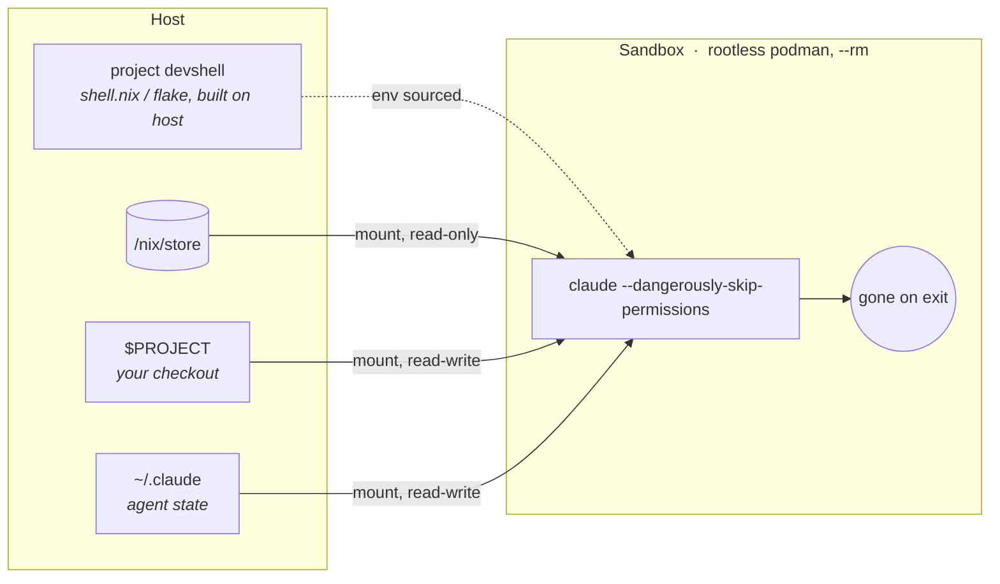

<div align="center">

<picture>
  <source media="(prefers-color-scheme: dark)" srcset="docs/assets/banner-dark.svg">
  
</picture>

**`bur`: a cage for your coding agent, built for the nix ecosystem**


</div>

> [!CAUTION]
> This project is early stage. Do not use it in a production environment
> without vetting and screening the code yourself first.

Run AI coding agents (`claude` by default) with full permissions *inside* a
rootless podman container instead of rubber-stamping approval prompts on the
host. Nix-first: the project's devshell (`shell.nix` or flake) **is** the
container environment - no images to build or maintain.

## Quick start

Requirements: linux, [rootless podman](https://podman.io/docs/installation),
and nix on the host. Then:

```sh
nix profile install github:jeliasson/bur
```

From any project with a `shell.nix` or `flake.nix`:

```sh
bur
```

That starts a fresh sandbox running `claude --dangerously-skip-permissions`:
full permissions inside the cage, none outside it. Exit claude and the
container is gone. For NixOS, other distros, source builds, and first-run
notes, see [installation](docs/installation.md).

## How it works

The devshell is built on the host, where nix and all caches live, and its
environment is sourced inside a throwaway container. Only three things cross
the wall:



Everything else stays outside: no `~/.ssh`, no git credentials, no display
server socket, no other repos. The full story - devshell resolution, the
read-only clipboard bridge, and pulling tools mid-session with `bur-pkg` -
is in [how it works](docs/how-it-works.md).

## Usage

| Command        | What it does                                                    |
| -------------- | --------------------------------------------------------------- |
| `bur`          | start a sandbox, running: `claude --dangerously-skip-permissions` |
| `bur bash`     | same sandbox environment, but a shell instead                   |
| `bur opencode` | or any other agent/command                                      |
| `bur exec bash`| second process inside a running sandbox of this project         |
| `bur ls`       | list running sandboxes                                          |
| `bur clean`    | remove every bur container and stale devshell GC roots          |
| `bur init`     | write a starter `.bur.yaml` and a gitignored `.bur.env`         |

Sandboxes are one-shot: each `bur` starts a fresh container that lives
exactly as long as its main process - no daemon, no state directory, as many
parallel sandboxes as you like. Details in [usage](docs/usage.md).

## Documentation

- [Installation](docs/installation.md) - NixOS module, other distros, building from source
- [Usage](docs/usage.md) - commands, sandbox lifecycle, `bur exec`, agent state
- [How it works](docs/how-it-works.md) - devshell resolution, clipboard bridge, `bur-pkg`
- [Configuration](docs/configuration.md) - `.bur.yaml` reference, git identity, secrets
- [Security model](docs/security.md) - what the cage does and doesn't protect

## Roadmap

The planned v2 flagship is `network: filtered`, a deny-by-default egress
allowlist. Beyond that the aim is to be a good citizen of the nix
ecosystem - nixpkgs inclusion is on the list. The nix-specific behavior
stays namespaced (the `nix:` config key), so other environment backends
remain possible later - macOS, hosts without nix - but nix comes first.

## License

[MIT](LICENSE)

---

<div align="center">

*bur* is Swedish for *cage* 🇸🇪

</div>
