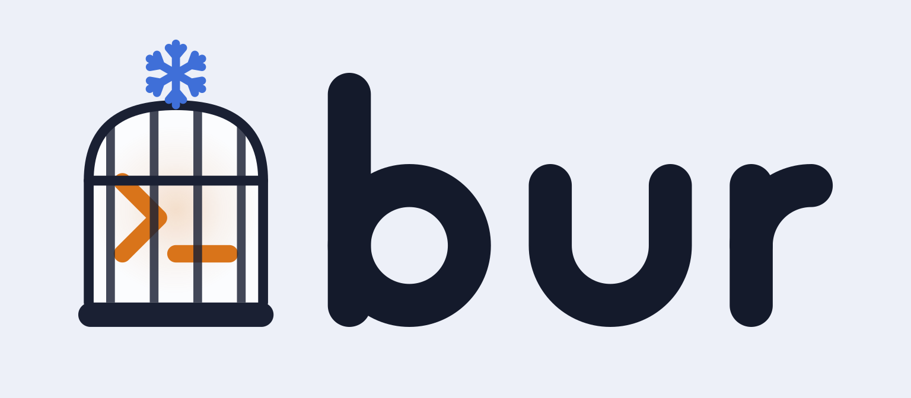

<div align="center">

<picture>
  <source media="(prefers-color-scheme: dark)" srcset="docs/assets/banner-dark.svg">
  
</picture>

**`bur`: a cage for your coding agent, built for the nix ecosystem**


</div>

> [!CAUTION]
> This project is early stage. Do not use it in a production environment
> without vetting and screening the code yourself first.

## Intro

Run AI coding agents (`claude` by default) with full permissions *inside* a
rootless podman container instead of rubber-stamping approval prompts on the
host. Nix-first: the project's devshell (`shell.nix` or flake) **is** the
container environment - no images to build or maintain.

## Quick start

Requirements: linux, [rootless podman](https://podman.io/docs/installation), and nix on the
host - building the project devshell is the whole point.

```sh
nix profile install github:jeliasson/bur
```

Then, from any project with a `shell.nix` or `flake.nix`:

```sh
bur
```

That starts a fresh sandbox running `claude --dangerously-skip-permissions`:
full permissions inside the cage, none outside it. Exit claude and the
container is gone.

Two notes for the first run: the command bur starts (`claude` by default)
must be nix-installed - on the host or in the devshell - so it resolves to
`/nix/store`; a `claude` from npm will not exist inside the sandbox. And a
project without a devshell still works - you get a minimal sandbox (bash,
CA certificates, your command), just no toolchain.

## Install

### NixOS

The module installs bur and takes care of rootless podman:

```nix
{
  imports = [ inputs.bur.nixosModules.default ];
  programs.bur.enable = true;
}
```

bur is also consumable as a flake input via `overlays.default` or
`packages.<system>.default`.

### Other Linux distros

Install rootless podman from your distro's packages and
[nix](https://nixos.org/download/) from any installer; the quick start then
works as-is. One thing to know: `nix profile install` needs flakes enabled
(`experimental-features = nix-command flakes` in `~/.config/nix/nix.conf`).

### Build from source

The binary is plain Go, so nix is not needed to build it:

```sh
git clone https://github.com/jeliasson/bur && cd bur
make build   # or: go build ./cmd/bur
```

A source build does not embed the `bur-base` image; point `BUR_BASE_IMAGE`
at any image that provides bash and CA certificates. `nix develop` sets it
to the flake's own image, which `make base-image` loads. Note that bur still
needs nix on the host at runtime - the project devshell is the container
environment, and commands are resolved through `/nix/store`. Making bur
useful without nix would be a new environment backend (see Roadmap), not
a build flavor.

## Usage

| Command        | What it does                                                    |
| -------------- | --------------------------------------------------------------- |
| `bur`          | start a sandbox, running: `claude --dangerously-skip-permissions` |
| `bur bash`     | same sandbox environment, but a shell instead                   |
| `bur opencode` | or any other agent/command                                      |
| `bur exec bash`| second process inside a running sandbox of this project         |
| `bur ls`       | list running sandboxes                                          |
| `bur clean`    | remove every bur container and stale devshell GC roots (asks first; `-f` skips) |
| `bur init`     | write a starter `.bur.yaml` and a gitignored `.bur.env` for secrets - only what is missing |

Sandboxes are one-shot: every `bur` starts a fresh container (named
`bur-<project>-<adjective>-<animal>`) that lives exactly as long as its main
process. Exit claude and it is gone - no daemon, no stack, no state directory
in the project, and as many parallel sandboxes per project as you like.
Closing the terminal hangs up the agent, which ends the sandbox too; should
one ever be orphaned (terminal SIGKILLed, agent ignoring SIGHUP), `bur clean`
sweeps it away. Session persistence is a job for your terminal multiplexer,
not the cage.

`bur exec` finds the sandboxes of the current project (by the same root walk
as the config). With several running it shows a picker - newest first, the
one started from your directory as the default - and `bur exec --in <name>`
(full name, or a unique suffix like `witty-yak`) skips the prompt, for
scripts or piped stdin.

Only claude's state (`~/.claude`, `~/.claude.json`) follows the agent into
the sandbox. Other agents start from scratch - add their state dirs to
`mounts:` (e.g. `~/.local/share/opencode`) to keep logins and history. The
same goes for `~/.gitconfig`: commits made inside the sandbox carry no
author identity unless you mount it.

## How it works

```text
HOST                                    CONTAINER (rootless podman, --rm)
┌──────────────────────────┐            ┌─────────────────────────────┐
│ nix print-dev-env        │            │ minimal base (bash, certs)  │
│ of the project devshell  │   mount    │  /nix/store       ◀── ro    │
│ /nix/store ──────────────┼───────────▶│  $PROJECT         ◀── rw    │
│ $PROJECT ────────────────┼───────────▶│  ~/.claude[.json] ◀── rw    │
│ ~/.claude ───────────────┼───────────▶│  └─ claude --skip-perms     │
└──────────────────────────┘            └─────────────────────────────┘
```

The devshell is built **on the host** (where nix and all caches live) and its
environment sourced inside the container; a `--profile` link under
`~/.cache/bur/gcroots/` protects it from garbage collection (`bur clean`
prunes the links of projects that no longer exist). When both
exist, `shell.nix` wins; a bare `flake.nix` uses its default devShell -
pure and pinned by `flake.lock`, so in a git repo only tracked files are
visible to the evaluation. The dev server
runs inside the same container with the same toolchain - publish its port and
you're done. Commands are resolved through the host PATH to store paths, so
`claude`, `bash`, etc. work even when the devshell doesn't include them.

The project is mounted at its **host path**, not a generic `/workspace`: the
prompt tells you which project a sandbox belongs to, and claude keys its
per-directory history on the cwd, so sessions map to the right project and
are resumable from the host too.

Pasting works, images included (ctrl+v in claude): agents read the
clipboard by shelling out to `wl-paste`/`xclip`, and bur puts shims by
those names on the sandbox PATH that forward reads over a unix socket to
the real tool on the host - `wl-paste` on Wayland, `xclip` on X11, whichever
matches your session must be installed there (any install works; it runs
on the host, so the nix-store rule for `cmd`/`tools` does not apply).
No compositor socket enters the container, and the bridge is strictly
read-only: the agent can paste *from* your clipboard, never write to it.
Works with `network: none` too; opt out entirely with `clipboard: false`.

When the agent hits a missing tool - say it wants to rasterize an svg and
the devshell has no imagemagick - it can pull one from nixpkgs mid-session:
`bur-pkg add imagemagick` inside the sandbox asks the host over a unix
socket, the host realizes `nixpkgs#imagemagick` with its own nix, and the
tools land on the sandbox PATH immediately (new store paths appear live
through the read-only `/nix/store` mount - no restart, no rebuild). No nix
machinery enters the cage: names are validated attribute paths resolved
against the **host's** nixpkgs registry, never against anything the agent
can write to, and the host never runs what it builds. Nothing is installed
either - the package is realized into the store behind a GC root that dies
with the sandbox, so the next `nix store gc` sweeps it away. Because the
host does the fetching, this works under `network: none` too. A short
`/run/bur/AGENT.md` inside the sandbox tells the agent all of this; opt
out with `nix.pkgAdd: false`.

## Config

Global `~/.config/bur/config.yaml`, per-project `.bur.yaml` (found by walking
up to the nearest `.bur.yaml` or `.git`). Both files are optional. Scalars
override, lists concatenate, `env` merges. `bur init` writes a commented
starter `.bur.yaml` in the current directory, plus a gitignored `.bur.env`
for secrets; it only creates what is missing, so it is safe to re-run.

Without any config, bur behaves as if you had written:

```yaml
cmd: [claude, --dangerously-skip-permissions]
network: open                   # full egress
hostAccess: false               # no host.containers.internal
clipboard: true                 # read-only paste bridge (text & images)
# nix.shell auto-detects: shell.nix first, then the flake's default devShell
# tools, ports, mounts and env start empty
```

Everything you can set, with example (non-default) values:

```yaml
cmd:                            # what the sandbox runs instead of claude
  - opencode
tools:                          # agent companion CLIs, resolved from the host PATH
  - openspec
  - gh
  - rg
ports:                          # published on 127.0.0.1; taken host ports fall through to the next free
                                # prefix a host IP to widen: "0.0.0.0:5173:5173" exposes to the LAN
  - 8000
  - "5173:5173"
mounts:
  - "~/fixtures:/fixtures:ro"
env:
  TARS_HONESTY_LEVEL: "0.9"
envFile: .env                   # where secrets live, relative to this file
                                # (default: .bur.env; "" reads none)
network: none                   # open | none  ("filtered" reserved for v2)
hostAccess: true                # adds host.containers.internal
clipboard: false                # kill the paste bridge, e.g. for sensitive work
nix:
  shell: ./shell.nix            # a nix file, or a flake installable like ".#dev"
  pkgAdd: false                 # kill the bur-pkg bridge (default: on)
```

`tools:` lists agent companion CLIs (spec tools, `gh`, `rg`, ...) that follow
the agent rather than the project - like `~/.claude`, they belong to every
sandbox, so putting them in each project's devshell would be the wrong
altitude. Each name is resolved on the host through symlinks to its nix
store package and that package's `bin/` is appended to the container PATH -
after the devshell, so a project-pinned version of the same tool wins.
Like the main command (and unlike the devshell profile), these store paths
are not GC-rooted.

### Secrets

`.bur.yaml` is meant to be committed, so an API key does not belong in its
`env:` block - and gitignoring the file itself would take the whole project
config with it. Keep secrets in `.bur.env` next to it instead. `bur init`
scaffolds and gitignores it alongside the config (and creates just the
missing one in a fresh clone); a project without secrets can simply delete
it - a missing `.bur.env` is fine.

The format is `KEY=VALUE` per line, `#` for comments, one optional layer of
quotes stripped, no interpolation and no multiline values. bur loads it from
the project root on top of `env:`, so a key set in both wins here. Values
reach the sandbox through a mode-0600 file podman reads, never as command
line arguments - the `podman run` process lives as long as the sandbox and
its `/proc` entry is world-readable.

`.bur.env` is only the default name. A project that already keeps its
secrets somewhere points `envFile:` at it, and `bur init` then scaffolds
and gitignores that file instead:

```yaml
envFile: .env       # relative to .bur.yaml; ~ and absolute paths work too,
                    # for one secrets file shared across projects.
                    # "" reads no env file at all.
```

A `~` or absolute path (or `""`) makes `bur init` skip the secrets file
entirely - a file shared across projects is yours to create and protect.

A configured file that does not exist is a warning on startup, while a
missing `.bur.env` is silent - not having one is the normal case.

## Security model

What the cage does and doesn't do.

**Protected** ✅

- The rest of your home (`~/.ssh`, other repos). bur refuses to start
  when the project root would resolve to `$HOME` itself - the classic
  trap is a dotfiles `.git` in `~` - so the home mount can never happen
  by accident; a `.bur.yaml` placed there is the explicit opt-in.
- Your nix store (mounted read-only), your OS.
- Workspace file ownership - the agent runs as your uid via
  `--userns=keep-id`, so workspace files stay yours.
- Published `ports:` bind to `127.0.0.1` by default, so a service the agent
  starts is reachable from the host but not the LAN. Opt into wider exposure
  per-port with an explicit host IP (`"0.0.0.0:5173:5173"`).
- Your display server. Clipboard paste goes through a read-only bridge
  (text and image types only); no Wayland or X11 socket is ever mounted,
  and clipboard *writes* are not bridged - an agent that could seed your
  clipboard could poison your next paste into a terminal.

**Not protected** ⚠️

- The project mount is your live checkout, fully writable - including
  `.git`, so local history can go down with the ship. The remote is the
  real safety net, and since neither `~/.ssh` nor `~/.git-credentials` is
  mounted, the agent normally has no way to push to it either.
- A cloned repo is trusted input before any cage exists: its `.bur.yaml`
  can add mounts, publish ports, set env, and replace the command, and its
  devshell (`shell.nix` / flake) is evaluated and built on the host when
  `bur` starts. Review both before the first run in an untrusted checkout.
- `~/.claude` is mounted rw - the agent can edit its own global settings.
- Secrets you pass via `env` or `.bur.env` + open egress = an exfiltration
  channel. Keeping them out of git does not keep them out of the cage. Use
  `network: none` for sensitive work; a deny-by-default egress allowlist
  (`network: filtered`) is the planned v2 flagship.
- Host services bound to `127.0.0.1` are unreachable even with `hostAccess`
  (pasta maps `host.containers.internal` to the host's external address) -
  bind `0.0.0.0` or, better, run the service in the sandbox.
- The host clipboard is readable by the agent the whole time a sandbox
  runs - that is what makes paste work. Copy a password from your manager
  mid-session and the agent could read it; set `clipboard: false` for
  sensitive work.

- `bur-pkg` lets the agent fetch any nixpkgs package via the host - trusted
  code from your own nixpkgs pin, never evaluated from agent-writable files,
  and gone after the next GC, but still your disk and bandwidth. Set
  `nix.pkgAdd: false` to close that valve.

Changing the *environment* mid-session is still deliberate friction: the
agent edits `shell.nix`, you restart `bur` - devshell changes get reviewed
like code. `bur-pkg` is the sanctioned exception for grabbing a one-off
tool, which is why it is limited to bare attribute names from the host's
own nixpkgs and leaves no trace past the sandbox.

## Roadmap

The planned v2 flagship is `network: filtered`, a deny-by-default egress
allowlist. Beyond that the aim is to be a good citizen of the nix
ecosystem - nixpkgs inclusion is on the list. The nix-specific behavior
stays namespaced (the `nix:` config key), so other environment backends
remain possible later - macOS, hosts without nix - but nix comes first.

## License

[MIT](LICENSE)

---

<div align="center">

*bur* is Swedish for *cage* 🇸🇪

</div>
